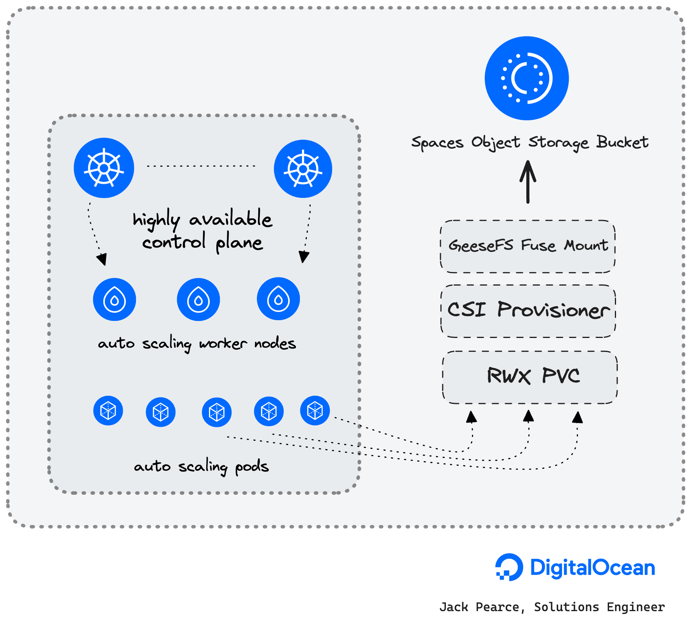

<br />
<div align="center">
  <a href="https://digitalocean.com/">
    
  </a>

<h3>How to use a Spaces Object Storage bucket as RWX storage for a Kubernetes Pod with DOKS (DigitalOcean Kubernetes)</h3>
</div>

- [Architecture diagram](https://github.com/jkpe/doks-s3/tree/main#architecture-diagram)
- [Deploy a DigitalOcean DOKS Cluster](https://github.com/jkpe/doks-s3/tree/main#deploy-a-digitalocean-doks-cluster)
- [Setup k8s-csi-s3](https://github.com/jkpe/doks-s3/tree/main#setup-k8s-csi-s3)
- [Troubleshooting](https://github.com/jkpe/doks-s3/tree/main#troubleshooting)
- [Benchmarks](https://github.com/jkpe/doks-s3/tree/main#benchmarks)

## About this guide

* In this guide we will deploy a DigitalOcean Managed Kubernetes cluster.
* We'll use [k8s-csi-s3](https://github.com/yandex-cloud/k8s-csi-s3) which is a [GeeseFS-based](https://github.com/yandex-cloud/geesefs) CSI for mounting S3 buckets as PersistentVolumes and give some working examples of consuming RMX storage.

#### About DigitalOcean DOKS

> DigitalOcean Kubernetes (DOKS) is a managed Kubernetes service that lets you deploy Kubernetes clusters without the complexities of handling the control plane and containerized infrastructure. Clusters are compatible with standard Kubernetes toolchains and integrate natively with DigitalOcean Load Balancers and volumes.

#### About DigitalOcean Spaces Object Storage

> Spaces Object Storage is an S3-compatible object storage service that lets you store and serve large amounts of data. Each Space is a bucket for you to store and serve files. The built-in Spaces CDN minimizes page load times and improves performance.

#### About GeeseFS

> Finally, a good FUSE FS implementation over S3

* GeeseFS allows you to mount an S3 bucket as a file system.
* FUSE file systems based on S3 typically have performance problems, especially with small files and metadata operations.
* GeeseFS **attempts to solve these problems** by using aggressive parallelism and asynchrony.
* GeeseFS is stable enough to pass most of xfstests which are applicable, including dirstress/fsstress stress-tests (generic/007, generic/011, generic/013).
* Benchmarks compared to rclone+cache, goofys and s3fs: https://github.com/yandex-cloud/geesefs/tree/master/bench

## Architecture diagram


## Introduction

This blueprint will teach you to:

- Deploy a DigitalOcean Kubernetes (DOKS) Cluster
- Deploy [k8s-csi-s3](https://github.com/yandex-cloud/k8s-csi-s3) which is a [GeeseFS-based](https://github.com/yandex-cloud/geesefs) CSI for mounting S3 buckets as PersistentVolumes and give some working examples of consuming RMX storage.

This blueprint is heavily based on:
- https://github.com/yandex-cloud/k8s-csi-s3

## Prerequisites

1. A DigitalOcean account ([Log in](https://cloud.digitalocean.com/login))
2. A DigitalOcean [Spaces Object Storage subscription](https://docs.digitalocean.com/products/spaces/how-to/create/)
3. doctl CLI([tutorial](https://docs.digitalocean.com/reference/doctl/how-to/install/))

## Deploy a DigitalOcean DOKS Cluster

### How to create a Kubernetes cluster using the DigitalOcean CLI

To create a Kubernetes cluster via the command-line, follow these steps:

1.  [Install `doctl`](https://docs.digitalocean.com/reference/doctl/how-to/install/), the DigitalOcean command-line tool.

2.  [Create a personal access token](https://docs.digitalocean.com/reference/api/create-personal-access-token/), and save it for use with `doctl`.

3.  Use the token to grant `doctl` access to your DigitalOcean account.

    ```
    doctl auth init
    ```

4.  Finally, create a Kubernetes cluster with `doctl kubernetes cluster create`.

    ```
    doctl kubernetes cluster create doks-shark-1 --auto-upgrade=true --ha=true --node-pool="name=pool-apps;size=s-4vcpu-8gb-amd;count=3" --region=ams3 --surge-upgrade=true
    ```

* `doks-shark-1` is our cluster name.
* We are creating one node pool for our regular workloads.
* The region is Amsterdam, surge-upgrades are enabled, HA is enabled, auto-upgrade is enabled.
* You'll want to [read the usage docs for more details](https://docs.digitalocean.com/reference/doctl/reference/kubernetes/cluster/create/)

## Setup k8s-csi-s3

Clone the [k8s-csi-s3](https://github.com/yandex-cloud/k8s-csi-s3) repo locally

```
git clone https://github.com/yandex-cloud/k8s-csi-s3
```

#### 1. Create a secret with your S3 credentials

Be sure to replace the `endpoint` URL with the same region as your DOKS cluster.
<br>Spaces availability per region is detailed [here.](https://docs.digitalocean.com/products/platform/availability-matrix/#other-product-availability)

```yaml
apiVersion: v1
kind: Secret
metadata:
  name: csi-s3-secret
  namespace: kube-system
stringData:
  accessKeyID: <YOUR_ACCESS_KEY_ID>
  secretAccessKey: <YOUR_SECRET_ACCESS_KEY>
  endpoint: https://ams3.digitaloceanspaces.com
```

#### 2. Deploy the driver

```bash
cd deploy/kubernetes
kubectl create -f provisioner.yaml
kubectl create -f driver.yaml
kubectl create -f csi-s3.yaml
```

#### 3. Create the storage class

```bash
kubectl create -f examples/storageclass.yaml
```

#### 4. Test the S3 driver

1. Create a pvc using the new storage class:

    ```bash
    kubectl create -f examples/pvc.yaml
    ```

1. Check if the PVC has been bound:

    ```bash
    $ kubectl get pvc csi-s3-pvc
    NAME         STATUS    VOLUME                                     CAPACITY   ACCESS MODES   STORAGECLASS   AGE
    csi-s3-pvc   Bound     pvc-c5d4634f-8507-11e8-9f33-0e243832354b   5Gi        RWO            csi-s3         9s
    ```

1. Create a test pod which mounts your volume:

    ```bash
    kubectl create -f examples/pod.yaml
    ```

    If the pod can start, everything should be working.

1. Test the mount

    ```bash
    $ kubectl exec -ti csi-s3-test-nginx bash
    $ mount | grep fuse
    pvc-035763df-0488-4941-9a34-f637292eb95c: on /usr/share/nginx/html/s3 type fuse.geesefs (rw,nosuid,nodev,relatime,user_id=65534,group_id=0,default_permissions,allow_other)
    $ touch /usr/share/nginx/html/s3/hello_world
    ```

If something does not work as expected, check the troubleshooting section below.

## Additional configuration

### Bucket

By default, csi-s3 will create a new bucket per volume. The bucket name will match that of the volume ID. If you want your volumes to live in a precreated bucket, you can simply specify the bucket in the storage class parameters:

```yaml
kind: StorageClass
apiVersion: storage.k8s.io/v1
metadata:
  name: csi-s3-existing-bucket
provisioner: ru.yandex.s3.csi
parameters:
  mounter: geesefs
  options: "--memory-limit 1000 --dir-mode 0777 --file-mode 0666"
  bucket: some-existing-bucket-name
```

If the bucket is specified, it will still be created if it does not exist on the backend. Every volume will get its own prefix within the bucket which matches the volume ID. When deleting a volume, also just the prefix will be deleted.

### Static Provisioning

If you want to mount a pre-existing bucket or prefix within a pre-existing bucket and don't want csi-s3 to delete it when PV is deleted, you can use static provisioning.

To do that you should omit `storageClassName` in the `PersistentVolumeClaim` and manually create a `PersistentVolume` with a matching `claimRef`, like in the following example: [deploy/kubernetes/examples/pvc-manual.yaml](deploy/kubernetes/examples/pvc-manual.yaml).

You can check POSIX compatibility matrix here: https://github.com/yandex-cloud/geesefs#posix-compatibility-matrix.

#### GeeseFS

* Almost full POSIX compatibility
* Good performance for both small and big files
* Does not store file permissions and custom modification times
* By default runs **outside** of the csi-s3 container using systemd, to not crash
  mountpoints with "Transport endpoint is not connected" when csi-s3 is upgraded
  or restarted. Add `--no-systemd` to `parameters.options` of the `StorageClass`
  to disable this behaviour.

## Troubleshooting

### Issues while creating PVC

Check the logs of the provisioner:

```bash
kubectl logs -l app=csi-provisioner-s3 -c csi-s3 -n kube-system
```

### Issues creating containers

1. Check the logs of the s3-driver:

```bash
kubectl logs -l app=csi-s3 -c csi-s3 -n kube-system
```


## Benchmarks

Spaces Object Storage limits are [detailed here](https://docs.digitalocean.com/products/spaces/details/limits/)

### Tests using `dd` and `fio`

- Use [`gen_small.py`](https://github.com/yandex-cloud/geesefs/blob/master/bench/gen_small.py) to create 6400 files, sized 0.5-300KB, 30KB on average, sharded over 1024 dirs with 2 level deep nesting
    - Copy this directory
    - Delete this directory
- Write 1GB and 5GB files to Spaces Object Storage
- Read 1GB and 5GB files from Spaces Object Storage

| Test                 | Command                                                      | Time      | Detail    |
|----------------------|--------------------------------------------------------------|-----------|-----------|
| Create 6400 files    | python3 gen_small.py /mnt/s3/test1                           | 11.3 s    |           |
| Copy the directory   | cp -r test1 test2                                            | 7.8 s     |           |
| Delete the directory | rm -r test1                                                  | 1.2 s     |           |
| Write 1GB            | dd if=/dev/zero of=largefile bs=1MB count=1000 oflag=direct  | 6.8215 s  | 147 MB/s  |
| Read 1GB             | dd if=largefile of=/dev/null bs=1MB iflag=direct             | 2.02862 s | 493 MB/s  |
| Write 5GB            | dd if=/dev/zero of=largefile5 bs=1MB count=5000 oflag=direct | 56.2905 s | 88.8 MB/s |
| Read 5GB             | dd if=largefile5 of=/dev/null bs=1MB iflag=direct            | 7.60369 s | 658 MB/s  |

### Dbench

Benchmarks ran using [dbench](https://github.com/jkpedo/dbench/tree/doks)

#### Native volume benchmarks

Below are the results of a `s-2vcpu-4gb-amd` worker node with a 1TB Volume attached using the `do-block-storage` storageClass

```
==================
= Dbench Summary =
==================
Random Read/Write IOPS: 9986/9987. BW: 384MiB/s / 387MiB/s
Average Latency (usec) Read/Write: 750.36/399.11
Sequential Read/Write: 384MiB/s / 395MiB/s
Mixed Random Read/Write IOPS: 7515/2471
```

#### S3 benchmarks

```
==================
= Dbench Summary =
==================
Random Read/Write IOPS: 126/1431. BW: 15.4MiB/s / 47.2MiB/s
Average Latency (ms) Read/Write: 36.1/3.1
Sequential Read/Write: 64.9MiB/s / 61.2MiB/s
Mixed Random Read/Write IOPS: 46/14
```

## Conclusion
